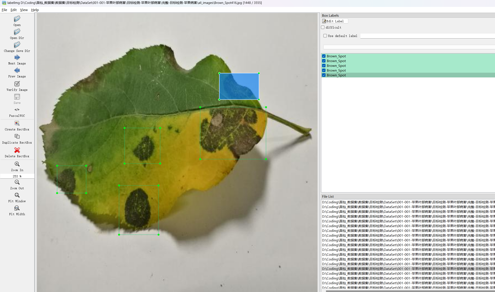

# Apple Leaf Disease Detection Dataset

Dataset Information: A total of 8055 images and corresponding annotation files are included. The annotation files come in two formats: VOC-XML files and YOLO-TXT files. The objects to be detected include the following:
['AlternariaBoltch', 'Blackrot', 'BrownSpot', 'Greyspot', 'Mosaic', 'Rust', 'Scab']
The information about each column, including the number of images and the number of bounding boxes, is as follows: (The markings are usually in English, but the Chinese names provided in parentheses are for reference)
Note: An image may be marked with multiple objects, so the total number of bounding boxes might be greater than the number of images.
The complete dataset consists of three folders and one txt file:
all_images folder: Stores the dataset's images. Screenshots are as follows:
all_txt folder and classes.txt: Stores the YOLO-TXT annotation files, which have the same quantity as the images, with each annotation file corresponding to an image.
classes.txt:
For a detailed understanding of the standard format of the YOLO-TXT file, please search for it on your own. In short, the number 0 represents the name of the object at the position specified by the index 0 in the array in classes.txt.
all_xml folder: VOC-XML annotation files. They have the same quantity as the images, with each annotation file corresponding to an image.
For a detailed understanding of the standard format of the VOC-XML files, please search for them on your own.
Both formats of annotations can be used, choose one based on your preference.
Annotation screenshots:

## Image

Here is a pay link on Stripe ( https://buy.stripe.com/3cs8yP7sY87d0vu9AB ). Please contact me lonlonago@foxmail.com after funding $89, and I will send you a complete data files , thank you!

